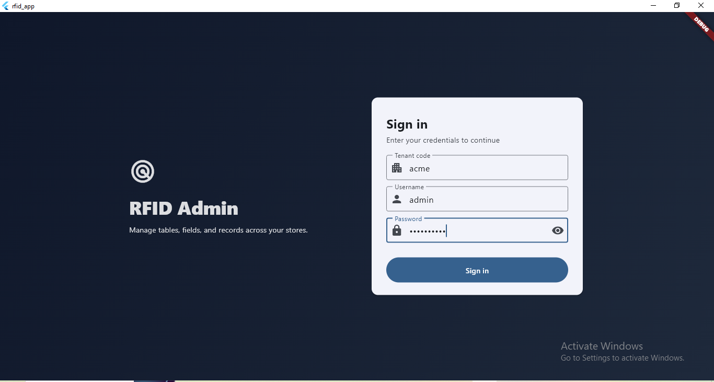
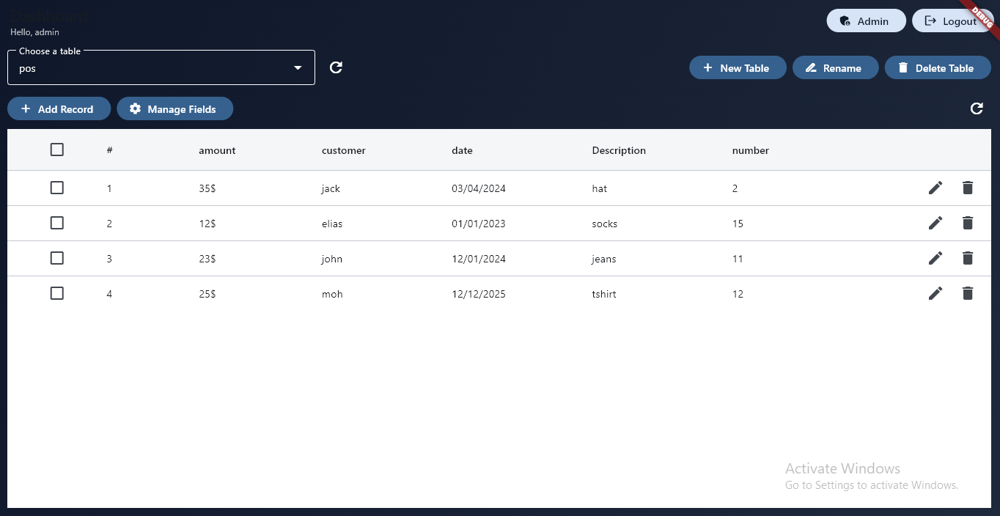
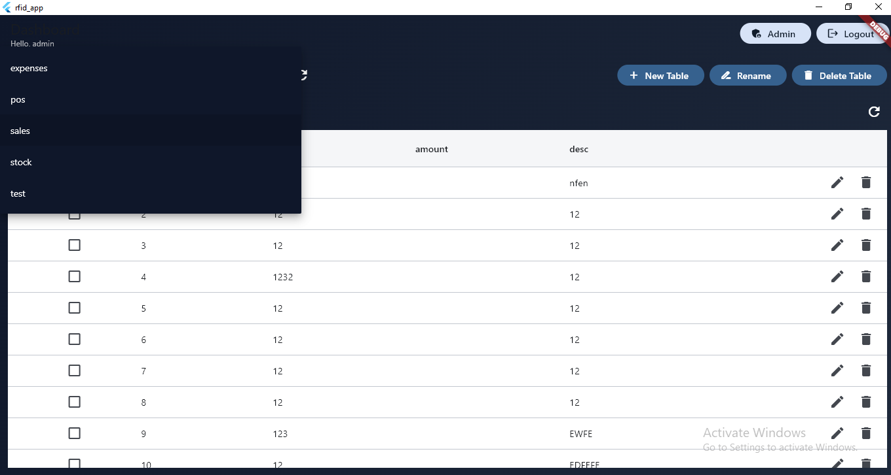
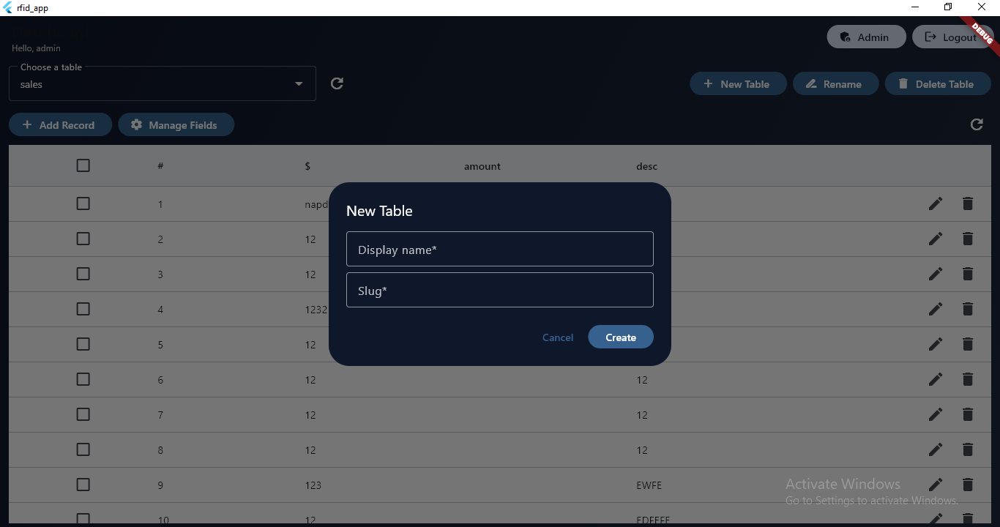
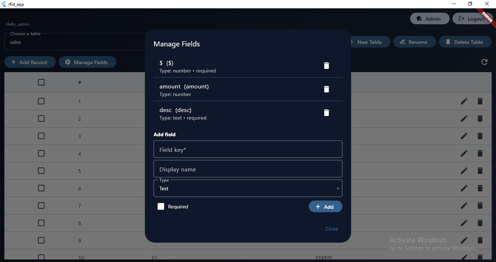
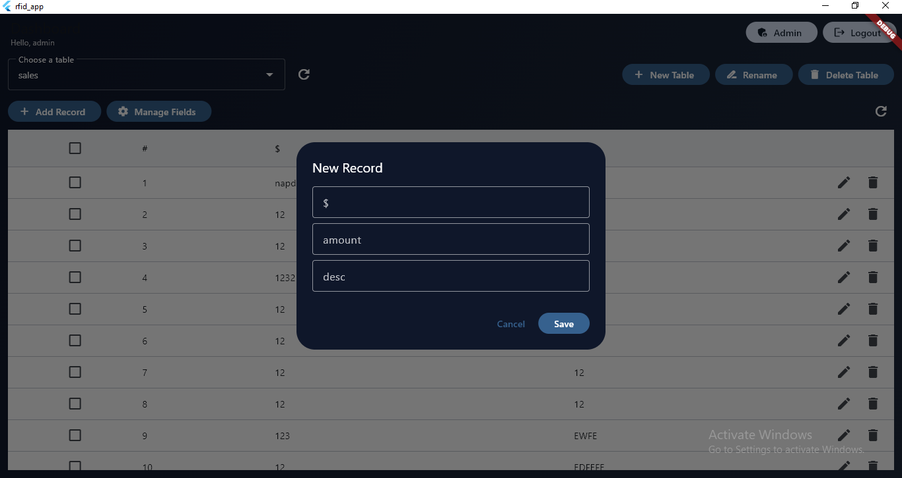
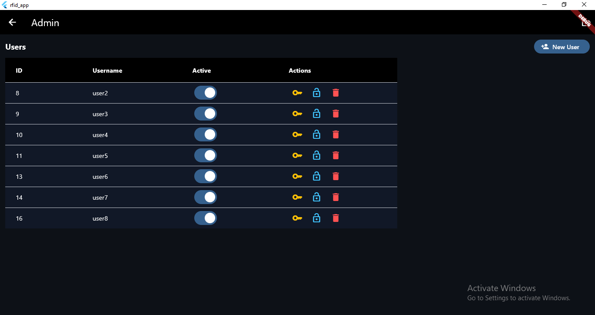
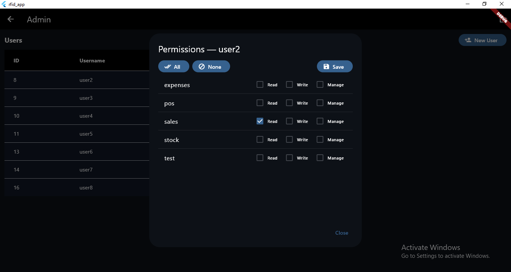
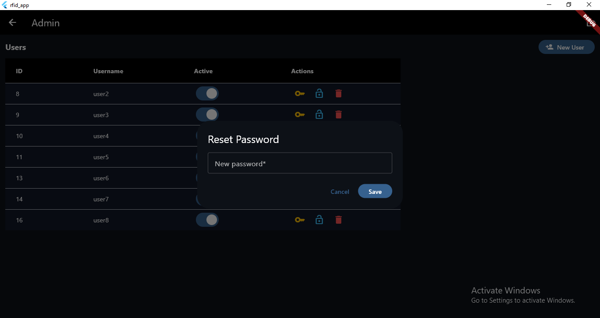
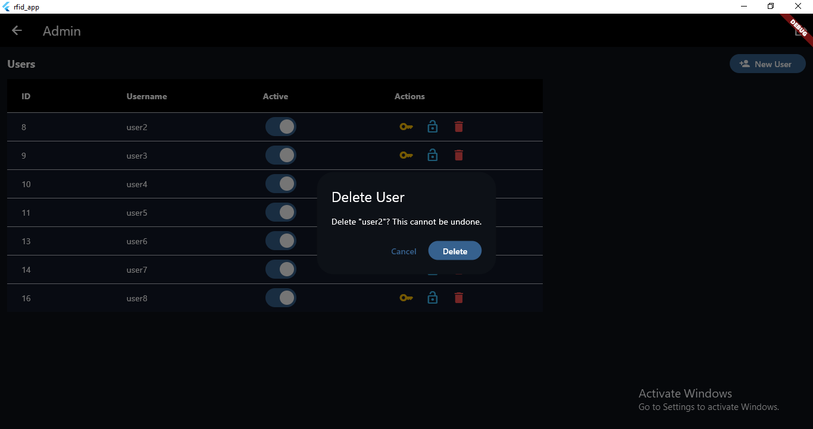

# rfid_app
FLUTTER APP

The RFID App is a multi-tenant application designed to manage tables, fields, records, and users with powerful admin functionalities. It provides a clean and intuitive interface for handling business data, managing permissions, and overseeing user access across different tenants.

## Screenshots
#LOGIN
The login page allows users to access the RFID Admin system using their tenant code, username, and password. This ensures secure access for different organizations within the multi-tenant environment.

#HOME
The home page provides access to all available tables. Users can add records, manage fields, rename or delete tables, and refresh data. It acts as the central dashboard for managing business data.

#CHOOSE TABLE
Users can select from multiple available tables (e.g., sales, expenses, stock, POS) from a dropdown menu. Each table displays relevant data fields and records.

#NEW TABLE
Users can create new tables by providing a display name and slug. This allows customization and organization of data according to business needs.

#MANAGE COLUMNS/FIELDS
The Manage Fields dialog enables users to add, edit, or delete fields within a table. Fields can be marked as required, and different types such as text, number, or date can be selected.

#ADD RECORD
This feature allows users to insert new records into the selected table. A dialog box appears to input values for each field, such as amount and description.

#ADMIN PAGE
The Admin Page lists all registered users. Admins can toggle user activity, reset passwords, assign permissions, or delete users. It serves as the core area for user management.

#PERMISSIONS
The Permissions panel allows admins to assign granular access to tables. Permissions include Read, Write, and Manage. Admins can control which tables users can access and what actions they can perform.

#RESET PASS
Admins can reset user passwords by entering a new password in the dialog box. This enhances account recovery and security.

#DELETE USER
Admins can permanently delete a user from the system. A confirmation dialog ensures that accidental deletions are avoided.

RFID Scanning
In addition to manual data entry, the RFID App allows users to scan data directly from RFID scanners. Scanned data is automatically captured and inserted into the appropriate tables, streamlining inventory management and reducing manual input errors. This feature makes the app especially powerful for businesses handling stock, shipments, and asset tracking.
